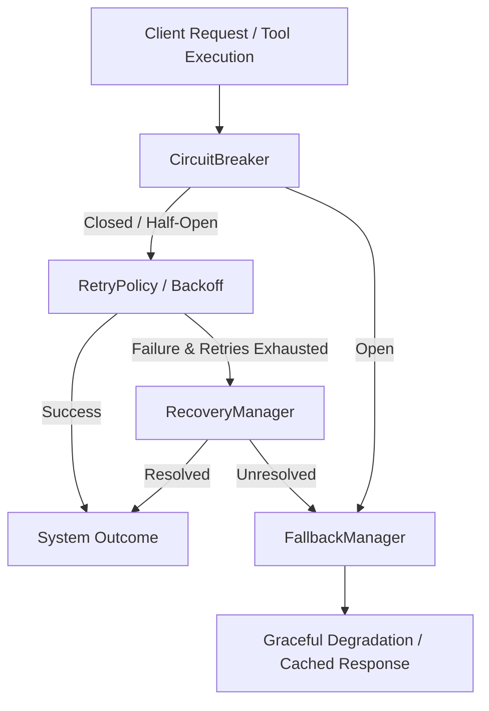

# Phase 5.5 – Pre-Implementation Audit Report

## Existing Reliability Features

| File | Feature | Status | Reusable? |
| ---- | ------- | ------ | --------- |
| [toolExecutor.ts](file:///C:/Users/dell/OneDrive/Desktop/personal%20ai%20assistant/src/agents/toolExecutor.ts) | Core `executeTool()` runner containing retries, timeouts, and transient error classification | Active / Fully implemented | **Yes** (Forms the runtime harness for tool calls) |
| [errorHandler.ts](file:///C:/Users/dell/OneDrive/Desktop/personal%20ai%20assistant/src/utils/errorHandler.ts) | `withRetry()` utility using simple exponential backoff; `safe()` / `safeAsync()` wrappers | Active / Global | **Yes** (Good for helper utilities or simple retry structures) |
| [browser.ts](file:///C:/Users/dell/OneDrive/Desktop/personal%20ai%20assistant/src/tools/laptop/browser.ts) | Wrap launch & page actions with `executeTool()` with configured `RetryPolicy` | Active | **Yes** (Good reference on how tools invoke `executeTool()`) |
| [api.ts](file:///C:/Users/dell/OneDrive/Desktop/personal%20ai%20assistant/src/tools/external/api.ts) | Wrap REST endpoints (Get, Post, Put, etc.) with `withApiRetry()` | Active | **Yes** (Shows integration with `executeTool` under custom policies) |
| [vector.ts](file:///C:/Users/dell/OneDrive/Desktop/personal%20ai%20assistant/src/memory/vector.ts) | Wrap vector DB queries & operations with `executeTool()` | Active | **Yes** (Demonstrates persistence safety) |

---

## Existing Retry Mechanisms

* **`src/utils/errorHandler.ts`**
  * Function: `withRetry<T>`
  * Default `maxAttempts`: `3`
  * Default `timeout`: Not per-attempt (standard Promise race/execution timeout must be wrapped externally or throws naturally)
  * Exponential Backoff: Yes (`baseDelayMs * 2 ** attempt`)
* **`src/agents/toolExecutor.ts`**
  * Function: `executeTool<T>`
  * Default `maxAttempts`: `3` (Configurable via `ExecutorConfig`)
  * Default `timeout`: `5000ms` (per-attempt via `Promise.race` with timer helper)
  * Exponential Backoff: Yes (`baseDelayMs * Math.pow(2, Math.max(0, attempt - 1))`)
* **`src/tools/external/api.ts`**
  * Function: `withApiRetry<T>` / `withLlmApiRetry<T>` / `withOllamaRetry<T>`
  * Default `maxAttempts`: `3` (Standard api), `3` (LLM policy), `3` (Ollama policy)
  * Default `timeout`: `20000ms` (API default), `60000ms` (LLM/Ollama policy)
  * Exponential Backoff: Yes (Wraps `executeTool` under custom config overrides)

---

## Existing Recovery Mechanisms

* **Browser Operations**: `src/tools/laptop/browser.ts` handles browser launch wrapper retries, automatically trying to spawn a clean Chromium instance if standard navigation or initialization fails, ensuring page connections are recycled on crash.
* **Ollama Operations**: `src/llm/ollama.ts` checks availability via health status. If a runner crash occurs, it executes `captureRunnerCrashDiagnostics` capturing environment details (memory stats, `ollama ps`, payload sizes) to JSONL files for clean diagnostics without crashing the primary orchestration loop.
* **System Operations**: Dynamic error mapping in `src/utils/errorHandler.ts` registers unhandled promise rejections and exit hooks (`SIGINT` / `SIGTERM`) to clean up subprocesses or browser page handlers cleanly.

---

## Existing Fallback Mechanisms

* **Empty Vector Fallback**: Integrated in semantic search routines (`src/memory/vector.ts`). If embedding client or database query errors occur, it falls back to keyword-based search or empty arrays to avoid crashing downstream flow.
* **API Fallbacks**: In `src/tools/external/api.ts`, classified transient/fatal errors return structured fallback states rather than throwing when fallback routes are defined by callers.
* **Browser Launcher**: In `src/tools/laptop/launcher.ts`, if a specific browser binary fails to launch on non-Windows platforms, it falls back automatically to default `openUrl` utilizing system open primitives (`xdg-open` or `open`).

---

## Existing Metrics

* **Retry Metrics**: `apiMetrics.apiRetries`, `metrics.browserRetries`, `metrics.computerRetries`, `agentMetrics.retries`.
* **Failure Metrics**: `apiMetrics.apiFailures`, `metrics.browserFailures`, `metrics.shellFailures`, `metrics.computerFailures`, `agentMetrics.failures`, `systemMetrics.failedRequests`.
* **Timeout Metrics**: `apiMetrics.timeoutCount`, `metrics.timeoutCount`.
* **Health Metrics**: Health state (`Healthy` | `Degraded` | `Unhealthy`) with scored details (Ollama offline, API failure rate, queue saturation, high latency, memory pressure) computed in `src/monitoring/health.ts`.
* **Dashboard Metrics**: Global aggregation structure defined in `src/monitoring/dashboard.ts` that includes system, agent, Ollama, tool, and API metrics registry snapshots.

---

## Potential Duplicates

* **Reused Elements**:
  * Reuse `src/agents/toolExecutor.ts`'s transient error classification (`classifyError`).
  * Reuse `src/utils/errorHandler.ts`'s retry backoff calculations.
  * Integrate resilience metrics directly into `src/monitoring/metrics.ts`.
* **Refactoring Candidates**:
  * Consolidate custom inline timeouts (e.g. `withTimeout` in `src/utils/helpers.ts`) under the new `RetryPolicies` or `CircuitBreaker` timeout layer.
  * Point direct `withApiRetry` and `withOllamaRetry` calls to the centralized `resilience/` infrastructure rather than keeping overlapping retry implementations.

---

## Recommended Architecture

### 1. `CircuitBreaker`
* **Implementation Location**: `src/resilience/circuitBreaker.ts`
* **Integration Points**:
  * Wrap Ollama calls in `src/llm/ollama.ts`.
  * Wrap external browser operations in `src/tools/laptop/browser.ts`.
  * Wrap HTTP clients in `src/tools/external/api.ts`.

### 2. `FallbackManager`
* **Implementation Location**: `src/resilience/fallbackManager.ts`
* **Integration Points**:
  * Provide alternative LLM choices or default canned text when Ollama trips.
  * Fall back to raw text extraction / offline caches when network scraping fails.
  * Return local mock context if the Vector Database is offline.

### 3. `RecoveryManager`
* **Implementation Location**: `src/resilience/recoveryManager.ts`
* **Integration Points**:
  * Automatically recycle browser instances when navigation actions error out consecutively.
  * Trigger model cache clear-ups or reset prompt buffers if prompt context limits throw memory/runner crashes.

### 4. `RetryPolicies`
* **Implementation Location**: `src/resilience/retryPolicies.ts`
* **Integration Points**:
  * Define standard policies: `TRANSIENT_API` (short timeouts, fast retries), `LLM_INFERENCE` (long timeouts, incremental backoff), `FILE_SYSTEM` (immediate retry, no backoff).

---

## Readiness & Phase Estimates

1. **Readiness Score**: **95/100** (Core execution, monitoring logs, metrics registry, and helper utilities are fully prepped and typed, meaning the new resilience layer can integrate smoothly without refactoring core business logic).
2. **Estimated Files to Change**: `8` files (`src/llm/ollama.ts`, `src/tools/external/api.ts`, `src/tools/laptop/browser.ts`, `src/monitoring/metrics.ts`, plus the `6` new resilience module files).
3. **Estimated Implementation Complexity**: **Medium** (Standard state machine for the circuit breaker, clean integration without violating existing test specs).
4. **Blockers**: None. The workspace is fully type-checked and compiles cleanly.
